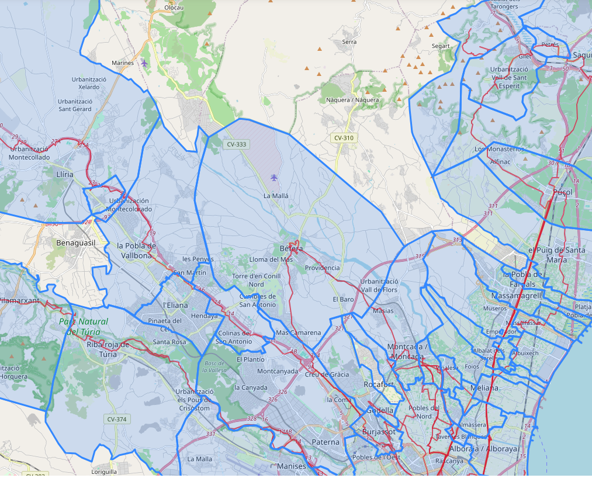

# StravaAnalysis

Analysis of the [Strava](https://www.strava.com/) activity of a user, scrapped through the [Strava API](https://developers.strava.com/) and visualized with [Folium](https://python-visualization.github.io/folium/latest/) and [Plotly](https://plotly.com/).

**See an example of the results in [this website](https://pablovd.github.io/misc/strava.html).**



## Authentication

Note: to run the scripts, one needs the authentication Strava information. See [here](https://developers.strava.com/docs/getting-started/) for the instructions to obtain it. This has to be provided as a json file `payload.json` in the form:

```json
{
    "client_id": "xxxx",
    "client_secret": "xxxx",
    "refresh_token": "xxxx",
    "grant_type": "refresh_token",
    "f": "json"
}
```

## Description

Two main scripts are provided:

- `StravaStats.ipynb` loads the activities from the Strava API and computes several statistics and visualizes the activties over a time period.
- `StravaMap.ipynb` loads the activities' gps data from the Strava API and visualize the routes in a map, together with the municipalities which includes those routes.

## To do

Planned tasks for the future:

- [x] Improve Eddington number plot
- [x] Efficient GPS import routine
- [x] Efficient municipalities routine
- [ ] Reorganize code better
- [ ] Improve how to store `acts_gps` using geopandas
- [ ] Improve to include other non-spanish regions
- [ ] Route and region info when hover
- [ ] Compute cluster of municipalities
